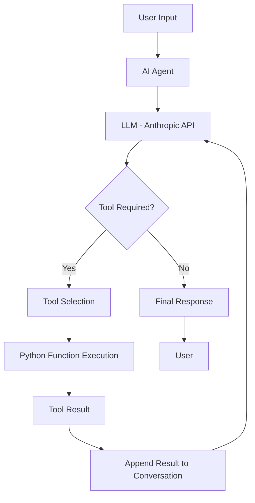

# AI Agent from Scratch in Python

A hands-on project to understand and build an **LLM-based AI Agent from scratch using Python and the Anthropic API**, without relying on orchestration frameworks. This project explores how an AI agent reasons about user requests, selects tools, executes functions, processes their results, and maintains conversational context.

Inspired by: [How (and Why) to Build an AI Agent from Scratch in Python](https://machinelearningmastery.com/how-and-why-to-build-an-ai-agent-from-scratch-in-python/)

## 🎯 Objectives

* Understand the fundamental architecture and working principles of AI agents.
* Build an LLM-powered agent using Python and the Anthropic API.
* Implement function and tool calling to interact with external services and data.
* Develop an agent execution loop to manage tool calls and model responses.
* Implement conversational memory to maintain context across multiple interactions.
* Understand how an agent can be extended into a more complex, production-oriented system.

## 🧠 What Is an AI Agent?

An AI agent is an LLM-powered system that can decide when it needs external information or tools to complete a task.

Unlike a conventional LLM application that generates a response based only on the provided prompt and context, an AI agent can:

1. Receive a user's request.
2. Determine whether a tool is required.
3. Select an appropriate tool and generate its input arguments.
4. Execute the selected function through the application.
5. Process the tool's output.
6. Generate a final response based on the retrieved information.

## 🏗️ Architecture

The agent follows a tool-calling architecture in which the LLM decides what action is needed, while Python executes the requested function.



### Core Components

* **LLM:** Understands user input, decides when to use tools, and generates responses.
* **Tool Definitions:** Describe available functions, their purposes, and required parameters.
* **Tool Executor:** Maps the LLM's tool request to the corresponding Python function and executes it.
* **Agent Loop:** Manages repeated model requests and tool execution until a final response is generated.
* **Memory:** Stores conversation history to maintain context across multiple user interactions.

## ⚙️ Technologies

| Technology            | Purpose                                         |
| --------------------- | ----------------------------------------------- |
| Python                | Core programming language                       |
| Anthropic API         | LLM inference and tool calling                  |
| Anthropic Python SDK  | Communication with the Anthropic API            |
| JSON                  | Tool schemas, arguments, and structured results |
| Environment Variables | Secure API key configuration                    |

## 📂 Project Structure

```text
A2A_Protocol/
│
├── main.py              # Main entry point for the AI agent
├── agent.py             # Agent loop and conversation management
├── tools.py             # Python functions available to the agent
├── tool_schemas.py      # Tool definitions and input schemas
├── requirements.txt     # Project dependencies
├── .env                 # Environment configuration (not committed)
├── .gitignore           # Excluded files
└── README.md            # Project documentation
```

*The structure can be adapted as the implementation evolves.*

## 🚀 Getting Started

### 1. Clone the Repository

```bash
git clone <repository-url>
cd A2A_Protocol
```

### 2. Create a Virtual Environment

```bash
python -m venv venv
```

Activate the environment:

**macOS / Linux**

```bash
source venv/bin/activate
```

**Windows**

```bash
venv\Scripts\activate
```

### 3. Install Dependencies

```bash
pip install anthropic python-dotenv
```

Alternatively, install dependencies from the requirements file:

```bash
pip install -r requirements.txt
```

### 4. Configure Environment Variables

Create a `.env` file in the project root:

```env
ANTHROPIC_API_KEY=your_api_key
```

Load the API key through environment variables rather than hardcoding it in the source code.

### 5. Run the Agent

Once the implementation is ready, run:

```bash
python main.py
```

## 🔄 Agent Execution Workflow

### 1. LLM Interaction

The agent sends the user's prompt and conversation history to the Anthropic API. The model determines whether it can answer directly or needs to call a tool.

### 2. Tool Definition

Each tool is defined with a name, description, and input schema. The schema informs the LLM about the tool's purpose and the arguments it requires.

Example:

```python
get_order_status_schema = {
    "name": "get_order_status",
    "description": "Retrieves the current status of an order.",
    "input_schema": {
        "type": "object",
        "properties": {
            "order_id": {
                "type": "string",
                "description": "The order ID"
            }
        },
        "required": ["order_id"]
    }
}
```

### 3. Tool Execution

When the model requests a tool, the application extracts the tool name and arguments, executes the corresponding Python function, and returns the result to the model.

The LLM does not directly execute Python functions. The application is responsible for validating and executing tool requests.

### 4. Agent Loop

The agent continues interacting with the model and executing requested tools until the model returns a final response.

A maximum iteration limit helps prevent the agent from repeatedly requesting tools without reaching a final answer.

### 5. Conversational Memory

Conversation history is maintained so that the agent can use information from earlier messages and tool results to respond to follow-up questions.

For longer conversations, memory can be extended with summarization, context-window management, and persistent storage.

## 🧪 Example Use Case

Consider an AI support agent that can retrieve order information from a database.

**User:**

> What is the status of my order 4471?

**Agent workflow:**

1. The LLM identifies that current order information is required.
2. It requests the `get_order_status` tool with the order ID.
3. The Python function retrieves the order details.
4. The tool result is returned to the LLM.
5. The LLM generates a user-friendly response.

**Example response:**

> Your order 4471 has been shipped and is expected to arrive in approximately two days.

This demonstrates how an AI agent can combine LLM capabilities with external functions to provide responses based on actual data.

## 🛡️ Error Handling and Limitations

Some important considerations when developing an agent include:

* **Iteration limits:** Prevent unbounded tool-calling loops.
* **Tool validation:** Validate tool names and arguments before execution.
* **API failures:** Handle network errors, rate limits, and unsuccessful model requests.
* **Tool failures:** Return clear error information when an external function fails.
* **Memory management:** Prevent conversation history from exceeding the model's context window.
* **Security:** Apply appropriate access controls and avoid exposing sensitive data through tools.

## 🔮 Future Improvements

* Integrate multiple tools, such as web search, database queries, and external APIs.
* Add persistent conversation memory using a database or cache.
* Implement multi-step task execution and more complex tool selection.
* Add structured logging and tracing to monitor agent decisions and tool calls.
* Evaluate tool-selection accuracy, response quality, latency, and token usage.
* Explore multi-agent communication and Agent-to-Agent (A2A) protocols.
* Compare a custom implementation with framework-based solutions such as LangChain.

## 📚 References

* [How (and Why) to Build an AI Agent from Scratch in Python — Machine Learning Mastery](https://machinelearningmastery.com/how-and-why-to-build-an-ai-agent-from-scratch-in-python/)
* [Anthropic API Documentation](https://docs.anthropic.com/)
* [Anthropic Python SDK](https://github.com/anthropics/anthropic-sdk-python)

## 📝 Learning Outcomes

This project provides a practical understanding of the internal mechanics of an LLM-based agent, particularly how tool calling, execution loops, and memory work together.

The goal is to understand the fundamental building blocks of AI agents before moving toward more advanced agentic AI architectures, multi-agent systems, and framework-based implementations.

---

**Status:** In Progress
**Focus:** AI Agents, LLM Tool Calling, Python, Agentic AI
**Language:** Python
**LLM Provider:** Anthropic
